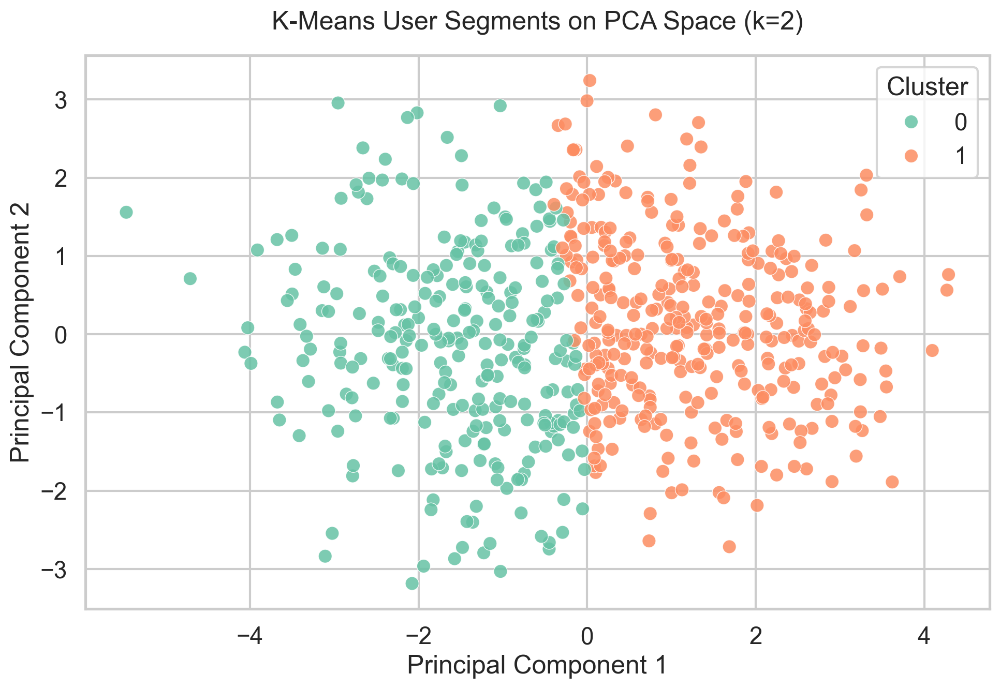
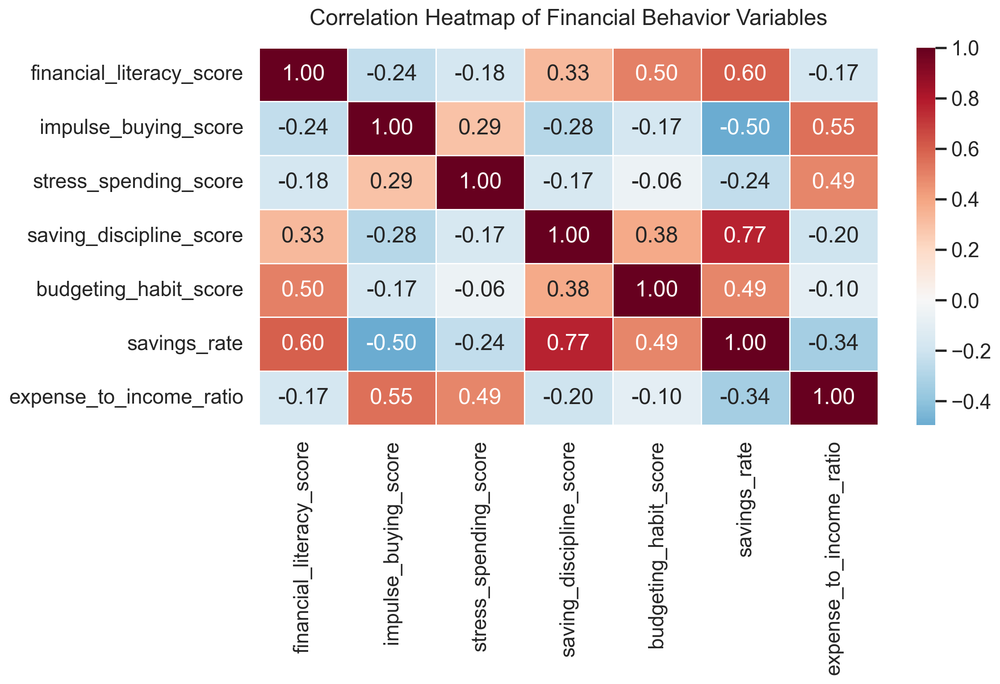
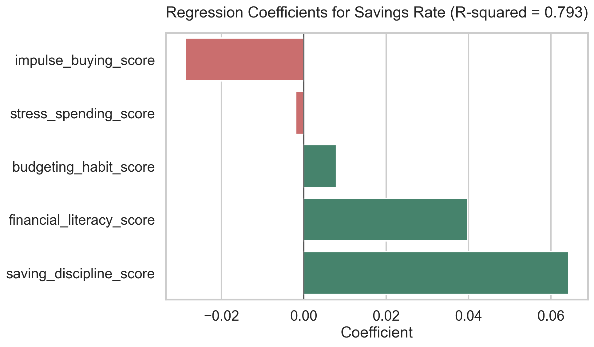
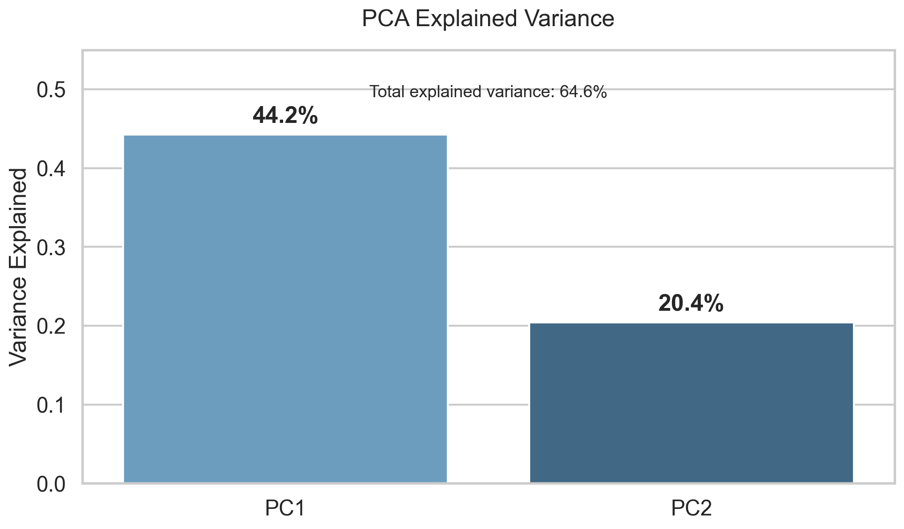

# Financial Behavior Segmentation  
## A Python-Based Statistical Analysis Using Synthetic Survey Data


This project analyzes financial behavior among young adults aged 18 to 35 using synthetic survey and spending data.

The goal is to identify meaningful behavioral segments based on income, expenses, savings, financial literacy, impulse buying, stress spending, saving discipline, and budgeting habits.

## 👨‍💻 Author

| Name | Role | GitHub |
| :--- | :--- | :--- |
| **Sanman Kadam** | Data Analyst / Data Scientist | [](https://github.com/the-irritater) |

## 📊 Project Information

| Field | Details |
| :--- | :--- |
| **Project Type** | Data Analytics Portfolio Project |
| **Dataset Type** | Synthetic financial behavior survey data |
| **Analysis Focus** | Hypothesis testing, regression, PCA, and K-Means clustering |
| **Tools Used** | Python, pandas, seaborn, scipy, statsmodels, scikit-learn |
| **Last Updated** | April 2026 |

## Project Preview

| Cluster Visualization | Correlation Heatmap |
|---|---|
|  |  |

| Regression Coefficients | PCA Explained Variance |
|---|---|
|  |  |

---

## Problem Statement

Many young adults struggle with saving money, managing expenses, controlling impulse purchases, and maintaining consistent budgeting habits.

Fintech companies, personal finance apps, banks, and financial advisors can use behavioral segmentation to design better financial guidance, alerts, and personalized recommendations.

This project answers a practical business question:

**Can we segment young users into meaningful financial behavior groups using statistical analysis and clustering?**

---

## Objectives

- Generate realistic synthetic financial behavior data.
- Analyze spending, saving, and psychological money habits.
- Test relationships between impulse buying, financial literacy, budgeting, and savings rate.
- Compare savings behavior across employment groups.
- Build regression models to explain savings rate.
- Use PCA and K-Means clustering to segment users.
- Translate clusters into actionable business recommendations.

---

## Dataset

The dataset is synthetic and contains 600 participants aged 18 to 35. 

📥 **[Download the Dataset](synthetic_financial_behavior_data.csv)**

### Demographic Variables

- Participant ID
- Age
- Gender
- Employment status
- City tier
- Monthly income

### Financial Variables

- Essential expenses
- Discretionary expenses
- Monthly savings
- Debt payment
- Total expenses
- Savings rate
- Expense-to-income ratio

### Behavioral Survey Variables

Likert-scale items from 1 to 5:

- Financial Literacy: FL1–FL5
- Impulse Buying: IB1–IB5
- Stress Spending: SS1–SS4
- Saving Discipline: SD1–SD5
- Budgeting Habit: BH1–BH4

### Composite Scores

- Financial literacy score
- Impulse buying score
- Stress spending score
- Saving discipline score
- Budgeting habit score

---

## Tools and Libraries

- Python
- pandas
- numpy
- matplotlib
- seaborn
- scipy
- statsmodels
- scikit-learn

---

## Statistical Methods Used

- Descriptive statistics
- Cronbach's Alpha
- Pearson correlation
- One-way ANOVA
- Multiple linear regression
- Principal Component Analysis
- K-Means clustering
- Silhouette score

---

## How to Run This Project

1. Clone or download this repository.
2. Install the required Python libraries:

```bash
pip install -r requirements.txt
```

3. Open the notebook:

```bash
jupyter notebook financial_behavior_segmentation_analysis.ipynb
```

4. Run all cells from top to bottom.

---

## Key Results

| Analysis Area | Result | Business Insight ("Why this matters") |
|---|---|---|
| **Survey reliability** | Strong Cronbach's Alpha values above 0.88 | Ensures that behavioral profiling is statistically robust before using it to target users. |
| **Impulse buying vs savings rate** | Moderate negative relationship, r = -0.495 | Behavioral spending directly impacts savings outcomes more than income alone. |
| **Stress spending vs savings rate** | Negative relationship, r = -0.244 | Emotional spending is a key friction point; users need "cool-off" nudges during high-stress periods. |
| **Financial literacy vs budgeting habit** | Moderate positive relationship, r = 0.501 | Educational content directly translates into stickier budgeting behaviors, proving the ROI of financial education. |
| **Regression model** | Explained 79.3% of variance in savings rate, R-squared = 0.793 | Psychological traits strongly predict financial health, allowing for early intervention scoring. *(Note: Since the dataset is synthetic, relationships may appear stronger than real-world data.)* |
| **Employment status ANOVA** | Savings rate differences across employment groups were not statistically significant, p = 0.171 | Employment type doesn't dictate savings success; behavioral intervention works for everyone. |
| **Best K-Means solution** | 2 clusters based on silhouette score = 0.246 | Identified distinct overarching behaviors (Tried K = 2–6, selected K=2 based on silhouette + interpretability). |
| **Final segments** | Disciplined Savers and Impulse Spenders | Provides a clear foundation for segment-based product experiences and targeted nudges. |

---

## Key Findings

- Impulse buying showed a statistically significant negative relationship with savings rate (r = -0.495), meaning users with stronger impulse-buying behavior tended to save less.
- Stress spending also showed a negative relationship with savings rate (r = -0.244), suggesting emotional spending pressure can reduce savings outcomes.
- Financial literacy was positively associated with budgeting habit (r = 0.501), showing that financially literate users were more likely to follow structured budgeting behavior.
- The regression model explained 79.3% of the variance in savings rate, with saving discipline, financial literacy, and impulse buying among the most important behavioral predictors. *(Note: Since the dataset is synthetic, relationships may appear stronger than real-world data. In real scenarios, additional noise and external factors would likely reduce model performance.)*
- K-Means clustering identified 2 distinct user segments with a silhouette score of 0.246: Disciplined Savers and Impulse Spenders.

---

## Key Research Questions

1. Are impulse buying and stress spending associated with lower savings rates?
2. Does financial literacy improve budgeting habits?
3. Do savings rates differ across employment groups?
4. Can users be segmented into meaningful financial behavior groups?

---

## Project Workflow

1. Generate synthetic financial behavior data.
2. Clean and inspect the dataset.
3. Calculate composite behavioral scores.
4. Test reliability using Cronbach's Alpha.
5. Perform exploratory data analysis.
6. Run hypothesis tests.
7. Build regression model for savings rate.
8. Apply PCA for dimensionality reduction.
9. Segment users using K-Means clustering.
10. Create actionable recommendations for each segment.

---

## Final Segments

The clustering analysis identified two primary financial behavior groups:

| Segment | Size | Behavioral Profile | Product Opportunity |
|---|---:|---|---|
| Disciplined Savers | 331 users | Higher savings rate, stronger budgeting habits, stronger saving discipline, lower impulse buying | Offer investment education, goal-based saving tools, automated savings plans, and wealth-building recommendations |
| Impulse Spenders | 269 users | Lower savings rate, higher impulse buying, higher expense pressure, weaker budgeting behavior | Offer spending alerts, cool-off nudges, category limits, weekly budget reminders, and short-term savings challenges |

These segments can help fintech companies personalize financial advice, improve user engagement, and design targeted savings or spending-control features.

---

## How This Can Be Used in Real Products

- Personalized savings nudges based on each user's behavioral segment.
- Behavioral alerts for impulse spending and stress-driven purchase patterns.
- Segment-based financial recommendations inside fintech or banking apps.
- Financial stress risk scoring for users with high expense pressure and low savings rate.
- Retention-focused product journeys, such as automated saving challenges for Impulse Spenders and investment education for Disciplined Savers.
- Revenue opportunities through targeted premium features, such as advanced budgeting tools, goal planning, and personalized financial coaching.

---

## Business Impact

This project can support:

- Personalized budgeting recommendations
- Saving habit improvement campaigns
- Financial wellness scoring
- Customer segmentation for fintech products
- Better targeting of financial education content

---

## Repository Structure

```text
financial-behavior-segmentation/
│
├── synthetic_financial_behavior_data.csv
├── financial_behavior_segmentation_analysis.ipynb
├── assets/
│   ├── cluster_plot.png
│   ├── heatmap.png
│   ├── pca_explained_variance.png
│   └── regression_coefficients.png
├── scripts/
│   └── generate_assets.py
├── requirements.txt
└── README.md
```

---

## Resume Bullet

Built a Python-based financial behavior segmentation project using synthetic survey data, hypothesis testing, regression analysis, PCA, and K-Means clustering to identify actionable user segments for personal finance and fintech applications.

---

## Limitations

- **Synthetic Data:** Since the dataset is synthetic, analytical relationships (like the regression R² of 0.793) appear stronger than they would in real-world scenarios due to a lack of organic noise. 
- **Moderate Cluster Separation:** The silhouette score of 0.246 indicates moderate cluster separation, suggesting behavioral overlap between users.

## Future Work

- **Real-World Dataset:** Validate findings using real-world transaction and survey data.
- **More Granular Clusters:** Explore alternative clustering methods (e.g., hierarchical clustering or GMM) and increase feature engineering to identify more nuanced sub-segments.
- **Time-Series Behavior:** Analyze longitudinal data to understand how user behaviors shift over time and in response to macroeconomic events.

---
[](https://www.linkedin.com/in/sanman-kadam-7a4990374/)
[](https://github.com/the-irritater)
---
## Note

This dataset is synthetic and created for portfolio and learning purposes. It should not be used for real financial decision-making.
